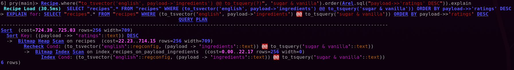
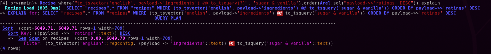

# Recipes by Ingredients Searcher Backend

This app it's a recipes searcher by ingredients that filters the results
returning only recipes that contains the ingredients passed as arguments and
ordering them by rating.
## 1.- Specifications

* Ruby version
	* 2.7.1
* Rails version
	* 7.0.2

* System dependencies
	* PostgreSQL database 14.1

## 2.- Configuration

### External dependencies

There's a `docker-compose.yml` file in the project to help you to install the external dependencies for the project. For doing it, you can follow the next steps:

1. Create the volume data folder specified in the docker-compose.yml file or modify it to the path of your preference.

```command
foo@bar:~$ mkdir postgres_data
```

2. Once the volume folder has been created, just execute the next command to start the service:

```command
foo@bar:~$ docker-compose up -d
```

### Project

For the project the gems `pg` and `rack-cors` have been included as dependencies. You can install these and the rest of dependencies executing the next command:

```command
foo@bar:~$ bundle install
```

### Database creation and initialization

For the database creation execute the next command in the project folder:

```command
foo@bar:~$ rake db:migrate:reset && rake db:seed
```

### Run the test suite

Tests have been implemented with *Rspec*. To run the test suite, execute the next command:

```command
foo@bar:~$ bundle exec rspec
```

### Application

To run the application, in the root project folder execute the next command:


```command
foo@bar:~$ rails server
```

## 3.- Application Design

### Database entities

There's only one table in the database with the next format:

#### Recipes Table ####

| field   		|  field type 	|
|---			|---			|
| id  			|  bigint 		|
| payload		|  jsonb 		|
| created_at  	|  timestamp 	|
| updated_at  	|  timestamp 	|

In the table`payload` field is inserted each recipe json provided in the assessment like next:

```json
{
        "title": "Golden Sweet Cornbread",
        "cook_time": 25,
        "prep_time": 10,
        "ingredients": [
            "1 cup all-purpose flour",
            "1 cup yellow cornmeal",
            "⅔ cup white sugar",
            "1 teaspoon salt",
            "3 ½ teaspoons baking powder",
            "1 egg",
            "1 cup milk",
            "⅓ cup vegetable oil"
        ],
        "ratings": 4.74,
        "cuisine": "",
        "category": "Cornbread",
        "author": "bluegirl",
        "image": "https://imagesvc.meredithcorp.io/v3/mm/image?url=https%3A%2F%2Fstatic.onecms.io%2Fwp-content%2Fuploads%2Fsites%2F43%2F2021%2F10%2F26%2Fcornbread-1.jpg"
    }
```

The decision to make it a jsonb field type has been taken due to, although it has a time cost in the register creation, it speed up searches and this will be mainly the use of the register.

Leveraging the capacity that PostgreSQL from its 10 version onwards provide to us to build full text search indexes over jsonb fields, 
I've added the next index over the `ingredients` json field.

`add_index :recipes, "to_tsvector('english', payload->'ingredients')", using: :gin, name: 'index_recipes_on_payload_ingredients'`

This way we can make full text search requests over the `ingredients` json field reducing the time consumed like the next two pictures reflect:

* Example query with index:




* Example query without index:



We can check that the same query for the table with the index took **30.5 ms** while the query without index took **805.0 ms**, that is a big improvement.
### Models

The model in this case contains only one scope that makes queries over the `ingredients` index like the previous paragraph describes.
### Controllers

The endpoints created for the applications are: 

HTTP Verb | Path                               | Controller#Action        | Used for                                    
--------- | ---------------------------------- | ------------------------ | --------------------------------------------
GET       | /api/v1/recipes                    | api/v1/recipes#index     | returns a set of recipes filtered by query string array parameters of type `ingredient[]=sugar` ordered by rating

## 4.- Application Interface

The interface that makes use of this API has been built in the next different repo:

* https://github.com/sourcedevelopersdotcom/recipes-front


## 5.- Application Running

The backend side of this application is deployed in the next url:

* https://mmachado-recipes-backend.herokuapp.com/api/v1/recipes

The frontend side of this application is deployed in the next url:

* https://mmachado-recipes-frontend.herokuapp.com/